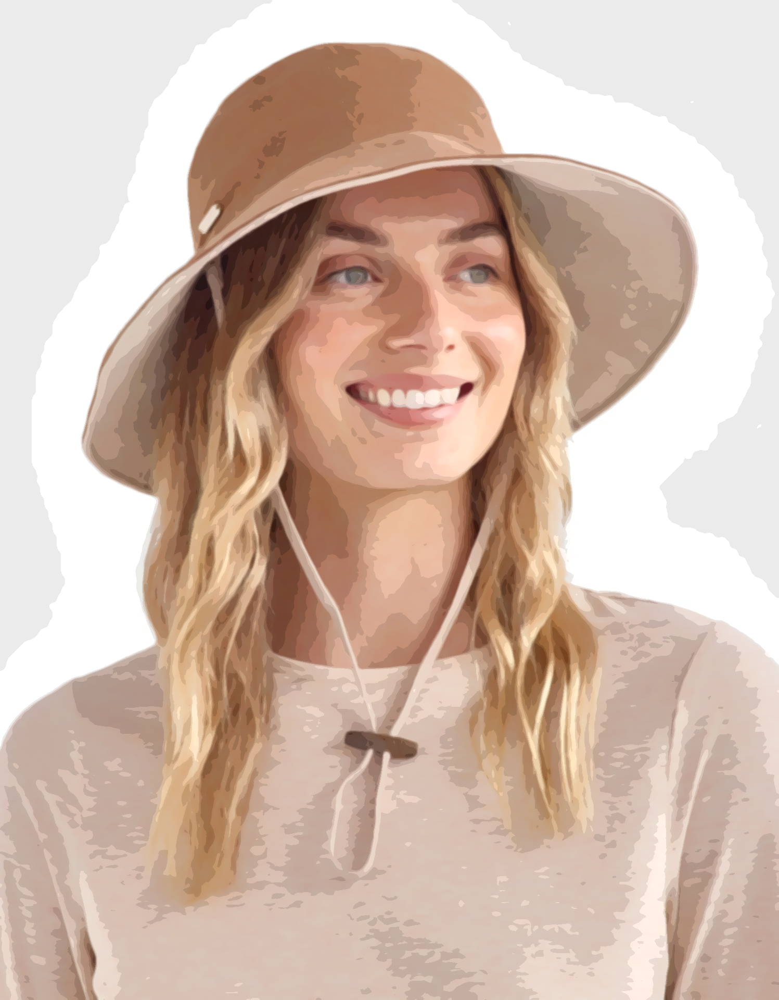
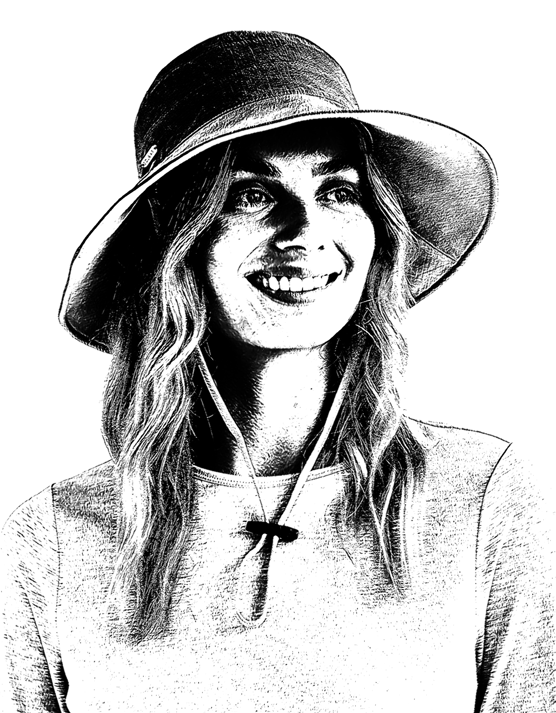
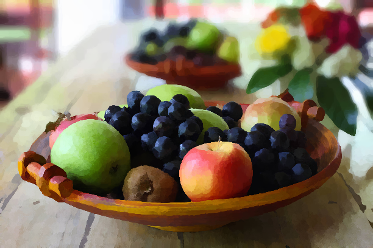
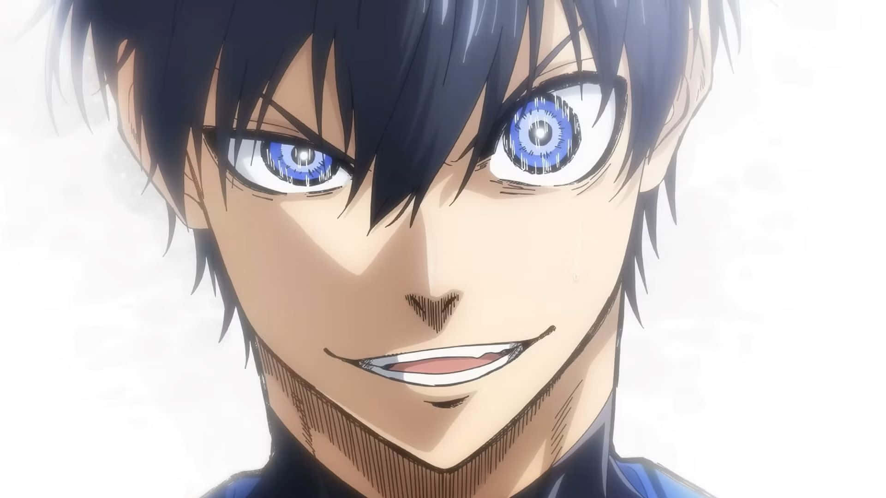
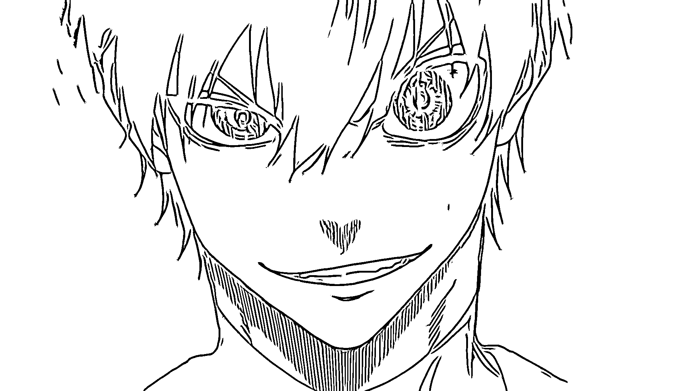

# 🖥️ NPR Studio
NPR Studio is a WebGL-powered application that allows users to stylize images using ausing a wide range of Non-Photorealistic Rendering (NPR) techniques. It includes advanced filters such as eXtended Difference of Gaussians (XDoG), Anisotropic Kuwahara Filtering, Flow-Based Bilateral Filtering, and many more. Explore and expreiment different artistic effects directly in the browser
## Table of Contents 
- [Features](#features)
- [Gallery](#gallery)
- [Tech Stack](#tech-stack)
- [Getting Started](#getting-started)
- [Usage](#usage)
- [Project Structure](#project-strcuture)
- [Future Directions](#future-directions)
- [Contributing](#contributing)
# Features
### **Image Processing Stylizations**
- **Composite Styles (multiple render pass)**:
	- [XDoG (Extended Difference of Gaussians)](https://users.cs.northwestern.edu/~sco590/winnemoeller-cag2012.pdf)
	- [Coherent Line Drawing (CLD)](https://cg.postech.ac.kr/papers/kang_npar07_hi.pdf)
	- [Flow-Based Bilateral Filtering (FBL)](https://www.umsl.edu/~kangh/Papers/kang_tvcg09.pdf)
	- [Anisotropic Kuwahara Filter](https://www.umsl.edu/~kangh/Papers/kang-tpcg2010.pdf)
	
- **Non-Composite Styles (single render pass)**: 
	- Sobel Edge Detection
	- Gaussian Blur (1D-Convolutions)
	- Sharpening, Embossing
	- Dithering 
	- Pixelization
	- Quantization & Luminance Quantization
	- Grayscale
	- Binary Thresholding  
	- Kuwahara Filter
	- Generalized Kuwahara Filter

…and more GPU-based shader effects.
### **Editing Tools**
- Zoom (mouse wheel, shortcuts, UI)
- Pan (drag or shift+wheel)
- Fit to Screen / Reset View
- Undo & Redo (WebGL framebuffer history stack)
- Real-time slider controls for all filter parameters
### **File Management**
- Drag-and-drop image uploading
- Export processed result as the initial uploaded format
[back to top](#table-of-contents)
# Tech Stack
### **Frontend**
- **React** (State management and context provider)
- **TypeScript** 
- **CSS Modules**
### **Rendering & Image Processing**
- **WebGL2** – GPU-accelerated 2D/3D rendering
- **GLSL** – Shader programming language for image effects
### **Build & Tooling**
- **Vite**
- **NPM**
[back to top](#table-of-contents)

# Gallery
| Original                                                                                      | XDoG Filter                                                                                 |
| --------------------------------------------------------------------------------------------- | ------------------------------------------------------------------------------------------- |
|  |  |

| Original                     | Anisotropic Kuwahara Filter              |
| ---------------------------- | ---------------------------------------- |
|  |  |

| Original                                               | Coherent Line Drawing (CLD) Filter |
| ------------------------------------------------------ | ---------------------------------- |
|  |                  |
# Getting Started
### **1. Clone the repository**

``` powershell
git clone https://github.com/G3rarrd/NPRStudio
```
### **2. Install dependencies**

```powershell
npm install
```
### **3. Start the development server**

```powershell
npm run dev
```
### **4. Build for production**

```powershell
npm run build
```
### **5. Preview production build**

```powershell
npm run preview
```
[back to top](#table-of-contents)

# Usage
### **1. Upload an Image**
- Drag and drop an image onto an upload area, **or** click the upload area to select a file at the start of the application
- Supported formats: **PNG, JPEG, JPG**.
### **2. Apply Filters**
- Select the filter options on the menu bar to add an effect to your image
- Adjust filter sliders (some don't have) based on your preference.
### **3. Navigate the Canvas**
- **Zoom** – `alt + mouseWheel`
- **Pan** – `Hold down the mouse wheel on the canvas`
- **Fit to Screen / Reset View** – Use view buttons in the menu bar
### **4. Undo / Redo**
- Undo - `ctrl+z`
- Redo - `ctrl+shift+z`
### **5. Import / Export**
- Click the **File** button in the menu bar and select **Export** to download the file or **Open** to load a new image 
[back to top](#table-of-contents)

# Project Structure
```powershell
├── App.css  
├── App.tsx  
├── assets/                     # Icons, logos  
├── features/
│   └── image_processing/       # Main image processing editor
│       ├── components/
│       │   ├── image_processing_context/ # Context manager of the editor
│       │   │   ├── image_processing_context.tsx
│       │   │   └── image_processing_provider.tsx
│       │   └── image_processing_upload/ # image drag-and-drop + file handling.
│       │       ├── components/
│       │       │   └── image_processing_upload_area/
│       │       ├── image_processing_upload_area.css
│       │       └── image_processing_upload_area.tsx
│       ├── image_processing_canvas/ # Canvas using WebGL2 API
│       │   ├── hooks/
│       │   │   └── useWebGL2DCamera.ts # handles zoom and pan done on the canvas
│       │   ├── image_processing_canvas.css
│       │   └── image_processing_canvas.tsx
│       ├── image_processing_index.css
│       ├── image_processing_index.tsx
│       ├── image_processing_menu_bar/
│       │   ├── components/
│       │   │   ├── image_processing_create_new_btn/
│       │   │   ├── image_processing_edit_btn/
│       │   │   ├── image_processing_file_btn/
│       │   │   ├── image_processing_filter_btn/
│       │   │   ├── image_processing_home_btn/
│       │   │   └── image_processing_view_btn/
│       │   ├── image_processing_menu_bar.module.css
│       │   └── image_processing_menu_bar.tsx
│       └── image_processing_tool_bar/
│           └── components/
├── hooks/
│   └── useUpload.ts
├── index.css
├── layouts/
│   └── image_processing_layout/
│       ├── hooks/
│       ├── image_processing_page_layout.module.css
│       └── image_processing_page_layout.tsx
├── main.tsx
├── pages/
│   ├── homes.tsx
│   ├── noPage.tsx
│   └── studio.tsx
├── services/
├── types/
│   └── slider.ts
├── engine/ # Image Processing Engine (Core of the application)
│   ├── Scene/ # Displays image on the canvas (rendering orchestrator)
│   ├── ShaderCodes/ # Contains shader codes of composite and non composite styles
│   ├── framebuffer_textures/ # Creation and management of framebuffers and textures
│   ├── math/
│   ├── random.ts
│   ├── webGLCore.ts
│   ├── webGLImageExporter.ts
│   └── webGLToneMapping.ts
└── vite-env.d.ts
```
[back to top](#table-of-contents)

# Future Directions
- Implementation of a node editor that allows the combination of multiple stylizations. Possible libraries include (Rete.js, React Flow, and LiteGraph.js)
- Addition of other Non-Photorealistic Rendering Techniques
[back to top](#table-of-contents)

# Contributing
Contributions are welcomed! Please feel free to submit pull requests, report bugs, or suggest new features.
[back to top](#table-of-contents)
